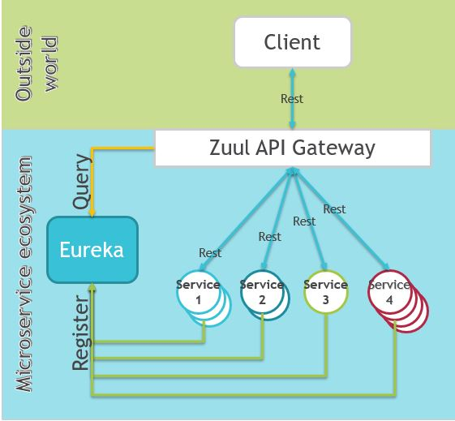
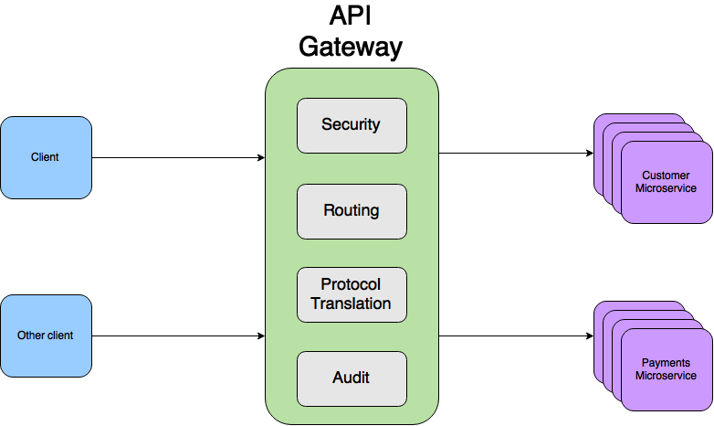

## Netflix Zuul Api Gateway

Zuul is an edge service that proxies requests to multiple backing services. It provides a unified “front door” to your system, which allows a browser, mobile app, or other user interface to consume services from multiple hosts without managing cross-origin resource sharing (CORS) and authentication for each one. 

#####  http://localhost:8765/{serivce-name}/URI

- http://localhost:8100/currency-converter-feign/from/EUR/to/INR/quantity/10000
- http://localhost:8765/currency-conversion-service/currency-converter-feign/from/EUR/to/INR/quantity/10000

- http://localhost:8000/currency-exchange/from/EUR/to/INR
- http://localhost:8765/currency-exchange-service/currency-exchange/from/EUR/to/INR

#### Main features of Zuul

- Provides a unified access to multiple different microservices
- Hides internal details of the microservice ecosystem
- Load balances across multiple service instances
- Allowes access to services
- Restricts access to internal only services
- Looks up services from Eureka
- Implements filters for authentication or logging purposes

#### Zuul filters
If a spring Bean extends ZuulFilter then it will be auto registered as a filter. Filters are most commonly used for

- Authentication
- Logging
- Serving static content
- Dynamic routing based on some conditions (A/B testing)

