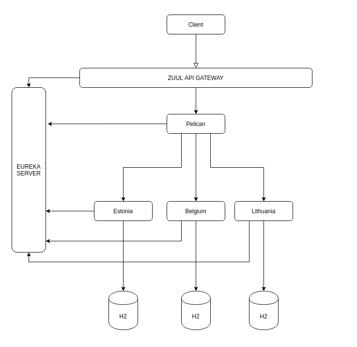

## Netflix Zuul Api Gateway

## Running
##### Previosly should run instance
- netflix-eureka-naming-server
- netflix-zuul-api-gateway-server
###### Then should run instance
- pelican
- estonia
- belgium
- lithuania
---

###### Eureka 
http://localhost:8761/

##### Gateway Url
###### Each Country Application Url
- http://localhost:8765/estonia/translation/Hello
- http://localhost:8765/belgium/translation/Hello
- http://localhost:8765/lithuania/translation/Hello

###### Pelican Url
- http://localhost:8765/pelican/estonia/Hello
- http://localhost:8765/pelican/belgium/Hello
- http://localhost:8765/pelican/lithuania/Hello

---
##### Direct Application Url
- Estonia http://localhost:8002/translation/Hello
- Belgium http://localhost:8003/translation/Hello
- Lithuania http://localhost:8004/translation/Hello

